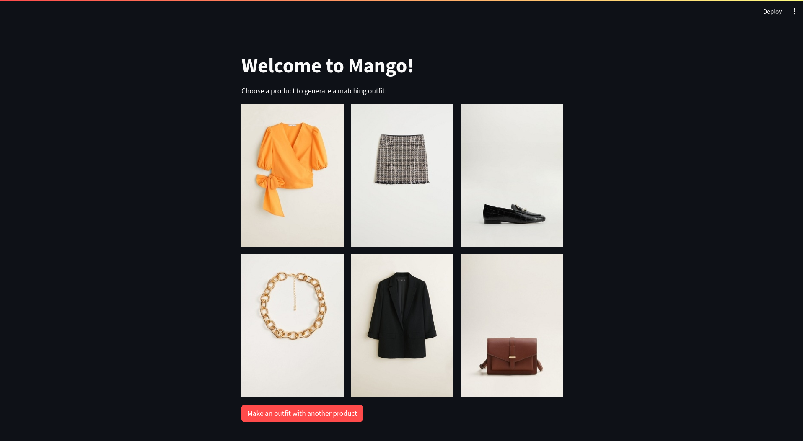

## About The Project




Introducing the MANGO Outfit Generator, an innovative application at the intersection of artificial intelligence and fashion curation. Navigating the dynamic landscape of the fashion industry is simplified with our generative AI, offering personalized and unique outfit suggestions. Experience a sophisticated approach to style exploration, where every outfit is meticulously crafted. Welcome to the forefront of fashion innovation.

### Built With

To build our awesome app, we have used the following frameworks and libraries:

* Streamlit
* TensorFlow
* Keras
* Pandas

## Getting Started

### Prerequisites

You will need the following dependencies installed before running the project:
* tensorflow
* pandas
* streamlit_image_select
* streamlit
 
### Installation

1. ```sh
    cd streamlit
   ```
2. ```sh
    pip3 install -r requirements.txt
   ```
3. ```sh
    streamlit run streamlit_app.py
   ```
## Usage

In the window you can choose between thousands of garments and our system will suggest a full outfit that matches the clothing you chose. 

## Contact

Biel Altés - 
Gerard Gispert - 
Carles Lobón - 
Miquel Rodoreda 

Project Link: [https://github.com/bielaltes/datathonfme2023](https://github.com/bielaltes/datathonfme2023)
